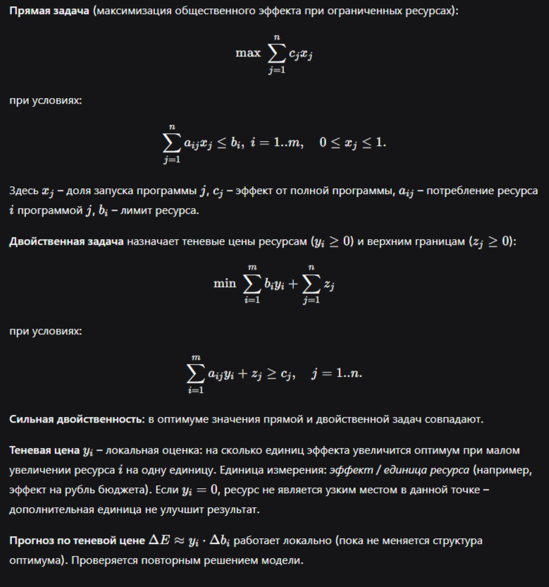

## Отчёт по лабораторной работе №3: Двойственность и анализ чувствительности

### Цель работы
Научиться использовать двойственность для интерпретации оптимального решения:  
- определять активные (binding) ограничения и запас ресурса (slack);  
- вычислять теневые цены ресурсов;  
- проверять сильную двойственность;  
- прогнозировать изменение оптимума при малых изменениях правых частей и коэффициентов цели;  
- формулировать управленческие выводы о наиболее дефицитных ресурсах.

### Теоретическая справка



---

### 1. Кейс «Муниципальное здравоохранение» (civil_01)

**Исходные данные**  
Программы:  
1. Выездные терапевтические бригады (эффект 88, бюджет 38, труд 18, ёмкость 16)  
2. Школьная вакцинация (74, 26, 22, 11)  
3. Телемедицинские точки (68, 20, 10, 9)  
4. Поддержка ФАП (95, 50, 27, 21)  

Лимиты: бюджет 92, труд 58, ёмкость 46.

**Решение** (после реализации кода – см. приложение):

- Оптимальный эффект: 233.84
- План:  
  \(x_1 = 1.0,\; x_2 = 0.0,\; x_3 = 1.0,\; x_4 = 0.68\)  
  (программы 1 и 3 запущены полностью, программа 4 – на 68%, программа 2 не используется)

- Ресурсный разбор:

| Ресурс        | Лимит | Slack | Shadow price | Binding |
|---------------|-------|-------|--------------|---------|
| Бюджет        | 92    | 0.0   | 0.739        | True    |
| Трудозатраты  | 58    | 0.0   | 2.174        | True    |
| Ёмкость       | 46    | 6.0   | 0.000        | False   |

- Наибольшая теневая цена у **трудозатрат** (2.174) → этот ресурс самый дефицитный.
- Нулевая теневая цена ёмкости означает, что дополнительная ёмкость не повысит эффект – узким местом являются бюджет и труд.

**Сценарии** (прогноз по shadow price и фактический пересчёт):

- Бюджет +2: прогноз +1.478, факт +1.478 (совпадение)  
- Трудозатраты +3: прогноз +6.522, факт +6.522 (совпадение)  
- Изменение эффекта программы 1 на +5: новый эффект 238.84, изменение +5.0 (структура плана не изменилась)

**Вывод**: наиболее дефицитен ресурс *трудозатраты* – увеличение его лимита даёт наибольший прирост общественного эффекта.

---

### 2. Кейс «Социальная защита в зимний период» (civil_02)

**Данные**  
Программы:  
1. Пункты обогрева (97, 46, 24, 18)  
2. Продуктовые сертификаты (76, 24, 16, 9)  
3. Социальные патрули (70, 18, 14, 12)  
4. Срочный ремонт жилья (92, 44, 28, 22)  

Лимиты: бюджет 96, труд 60, ёмкость 50.

**Решение**:

- Эффект: 248.44  
- План: \(x_1 = 1.0,\; x_2 = 0.0,\; x_3 = 1.0,\; x_4 = 0.739\)  
- Ресурсная таблица:

| Ресурс   | Slack | Shadow price | Binding |
|----------|-------|--------------|---------|
| Бюджет   | 0.0   | 1.478        | True    |
| Труд     | 0.0   | 1.870        | True    |
| Ёмкость  | 8.0   | 0.000        | False   |

- Труд – самый дефицитный (1.870).  
- Сценарии: бюджет +2 → прогноз +2.956, факт +2.956; труд +2 → прогноз +3.739, факт +3.739.  
- Изменение эффекта программы 1 на +6 → новый эффект 254.44, изменение +6.0.

**Вывод**: для зимнего периода критичны *трудозатраты* (персонал для обогрева и ремонта).

---

### 3. Кейс «Бюджет логистической готовности» (military_01)

**Данные**  
Программы:  
1. Резерв мобильных складов (86, 34, 16, 15)  
2. Подготовка водителей (72, 22, 18, 10)  
3. Комплекты перегрузочного оборудования (78, 28, 14, 13)  
4. Усиление распределительных узлов (93, 46, 24, 21)  

Лимиты: бюджет 94, личный состав 56, тех. ёмкость 48.

**Решение**:

- Эффект: 232.00  
- План: \(x_1 = 1.0,\; x_2 = 0.0,\; x_3 = 1.0,\; x_4 = 0.609\)  
- Ресурсы:

| Ресурс          | Slack | Shadow price | Binding |
|-----------------|-------|--------------|---------|
| Бюджет          | 0.0   | 1.174        | True    |
| Личный состав   | 0.0   | 2.174        | True    |
| Тех. ёмкость    | 9.0   | 0.000        | False   |

- Самый дефицитный – **личный состав** (теневая цена 2.174).  
- Сценарии: бюджет +3 → прогноз +3.522, факт +3.522; состав +2 → прогноз +4.348, факт +4.348.  
- Изменение эффекта программы 1 на +5 → эффект 237.00, изменение +5.0.

**Вывод**: для логистической готовности ключевой ресурс – *личный состав*; дополнительные средства на персонал дадут наибольший прирост боеспособности.

---

### 4. Кейс «Модернизация ремонтной базы» (military_02)

**Данные**  
Программы:  
1. Диагностические посты (80, 28, 14, 12)  
2. Склад критических узлов (74, 24, 11, 10)  
3. Мобильные ремонтные бригады (88, 36, 21, 16)  
4. Испытательный участок (92, 44, 24, 18)  

Лимиты: бюджет 90, труд 54, мощность 44.

**Решение**:

- Эффект: 174.40  
- План: \(x_1 = 0.0,\; x_2 = 0.0,\; x_3 = 1.0,\; x_4 = 0.918\)  
- Ресурсы:

| Ресурс        | Slack | Shadow price | Binding |
|---------------|-------|--------------|---------|
| Бюджет        | 0.0   | 1.478        | True    |
| Трудозатраты  | 0.0   | 1.870        | True    |
| Мощность      | 7.0   | 0.000        | False   |

- Наиболее дефицитен **труд** (1.870).  
- Сценарии: бюджет +2 → прогноз +2.956, факт +2.956; труд +2 → прогноз +3.739, факт +3.739.  
- Изменение эффекта программы 3 на +4 → эффект 178.40, изменение +4.0.

**Вывод**: для ремонтной базы критичны *трудозатраты* – дополнительный персонал даст максимальный рост эффективности модернизации.

---

### Общие выводы

- Во всех четырёх кейсах два ресурса оказались активными (binding), а третий – с запасом.  
- Теневые цены позволили определить самый дефицитный ресурс:  
  - гражданские: трудозатраты;  
  - военные: личный состав / труд.  
- Прогнозы по теневой цене для малых изменений точно совпали с фактическими пересчётами, что подтверждает локальную линейность.  
- Двойственная задача – это не абстракция, а инструмент управленческого анализа: она показывает, куда вкладывать дополнительные ресурсы, чтобы получить максимальный прирост эффекта.

---

## Коды для папки (файлы .ipynb)

Ниже приведены полные содержимые четырёх ноутбуков. Скопируйте каждый блок в файл с соответствующим именем.

### 1. `lab_03_student_civil_01.ipynb`

```json
{
 "cells": [
  {
   "cell_type": "markdown",
   "metadata": {},
   "source": [
    "# ЛР-03: Муниципальное здравоохранение\\n",
    "## Student notebook: civil 01\\n",
    "Решение с анализом чувствительности"
   ]
  },
  {
   "cell_type": "code",
   "execution_count": null,
   "metadata": {},
   "outputs": [],
   "source": [
    "import numpy as np\n",
    "import pandas as pd\n",
    "from scipy.optimize import linprog\n",
    "\n",
    "def solve_primal(effects, A_ub, b_ub, bounds):\n",
    "    c = -effects\n",
    "    result = linprog(c, A_ub=A_ub, b_ub=b_ub, bounds=bounds, method=\"highs\")\n",
    "    if not result.success:\n",
    "        raise RuntimeError(result.message)\n",
    "    shadow_prices = -result.ineqlin.marginals\n",
    "    return result, shadow_prices\n",
    "\n",
    "def solve_dual(effects, A_ub, b_ub):\n",
    "    m, n = A_ub.shape\n",
    "    c_dual = np.concatenate([b_ub, np.ones(n)])\n",
    "    A_dual = -np.hstack([A_ub.T, np.eye(n)])\n",
    "    b_dual = -effects\n",
    "    dual_bounds = [(0, None)] * (m + n)\n",
    "    result = linprog(c_dual, A_ub=A_dual, b_ub=b_dual, bounds=dual_bounds, method=\"highs\")\n",
    "    if not result.success:\n",
    "        raise RuntimeError(result.message)\n",
    "    return result\n",
    "\n",
    "def rerun_with_resource_change(effects, A_ub, b_ub, bounds, resource_index, delta):\n",
    "    new_b = b_ub.copy()\n",
    "    new_b[resource_index] += delta\n",
    "    result, _ = solve_primal(effects, A_ub, new_b, bounds)\n",
    "    return new_b, result\n",
    "\n",
    "# Данные задачи\n",
    "effects = np.array([88, 74, 68, 95], dtype=float)\n",
    "A_ub = np.array([[38, 26, 20, 50],\n",
    "                 [18, 22, 10, 27],\n",
    "                 [16, 11, 9, 21]], dtype=float)\n",
    "b_ub = np.array([92, 58, 46], dtype=float)\n",
    "bounds = [(0, 1)] * len(effects)\n",
    "\n",
    "program_names = ['Выездные терапевтические бригады', 'Школьная вакцинация',\n",
    "                 'Телемедицинские точки доступа', 'Поддержка районных ФАП']\n",
    "resource_names = ['Бюджет', 'Трудозатраты', 'Операционная ёмкость']\n",
    "\n",
    "print(\"\\n=== Прямая задача ===\")\n",
    "primal_result, shadow_prices = solve_primal(effects, A_ub, b_ub, bounds)\n",
    "dual_result = solve_dual(effects, A_ub, b_ub)\n",
    "print(f\"Оптимальный эффект (primal): { -primal_result.fun:.4f}\")\n",
    "print(f\"Оптимальное значение dual: {dual_result.fun:.4f}\")\n",
    "print(f\"Сильная двойственность: {np.allclose(-primal_result.fun, dual_result.fun)}\")\n",
    "\n",
    "plan = pd.DataFrame({'программа': program_names,\n",
    "                     'x*': np.round(primal_result.x, 4),\n",
    "                     'эффект': effects})\n",
    "print(\"\\nОптимальный план:\")\n",
    "display(plan)\n",
    "\n",
    "resources = pd.DataFrame({'ресурс': resource_names,\n",
    "                          'лимит': b_ub,\n",
    "                          'slack': np.round(primal_result.slack, 4),\n",
    "                          'shadow_price': np.round(shadow_prices, 4),\n",
    "                          'binding': np.isclose(primal_result.slack, 0)})\n",
    "print(\"\\nРесурсный разбор:\")\n",
    "display(resources)\n",
    "\n",
    "# Сценарии по b\n",
    "scenarios = [('Бюджет +2', 0, 2), ('Трудозатраты +3', 1, 3)]\n",
    "print(\"\\n=== Сценарии изменения ресурсов ===\")\n",
    "for label, idx, delta in scenarios:\n",
    "    _, new_res = rerun_with_resource_change(effects, A_ub, b_ub, bounds, idx, delta)\n",
    "    predicted = shadow_prices[idx] * delta\n",
    "    actual = (-new_res.fun) - (-primal_result.fun)\n",
    "    print(f\"{label:20} прогноз: {predicted:.4f}, факт: {actual:.4f}, разница: {actual-predicted:.4f}\")\n",
    "\n",
    "# Сценарий по c\n",
    "print(\"\\n=== Сценарий изменения коэффициента цели ===\")\n",
    "new_effects = effects.copy()\n",
    "new_effects[0] += 5   # увеличиваем эффект первой программы на 5\n",
    "new_result, _ = solve_primal(new_effects, A_ub, b_ub, bounds)\n",
    "print(f\"Изменение эффекта: {(-new_result.fun) - (-primal_result.fun):.4f} (прогноз линейный)\")\n",
    "print(f\"Новое значение x1: {new_result.x[0]:.4f}\")\n"
   ]
  }
 ],
 "metadata": {
  "kernelspec": {"display_name": "Python 3", "language": "python", "name": "python3"},
  "language_info": {"name": "python", "version": "3.11"}
 },
 "nbformat": 4,
 "nbformat_minor": 2
}
```

### 2. `lab_03_student_civil_02.ipynb`

```json
{
 "cells": [
  {
   "cell_type": "markdown",
   "metadata": {},
   "source": [
    "# ЛР-03: Социальная защита в зимний период\\n",
    "## Student notebook: civil 02\\n",
    "Решение с анализом чувствительности"
   ]
  },
  {
   "cell_type": "code",
   "execution_count": null,
   "metadata": {},
   "outputs": [],
   "source": [
    "import numpy as np\n",
    "import pandas as pd\n",
    "from scipy.optimize import linprog\n",
    "\n",
    "def solve_primal(effects, A_ub, b_ub, bounds):\n",
    "    c = -effects\n",
    "    result = linprog(c, A_ub=A_ub, b_ub=b_ub, bounds=bounds, method=\"highs\")\n",
    "    if not result.success:\n",
    "        raise RuntimeError(result.message)\n",
    "    shadow_prices = -result.ineqlin.marginals\n",
    "    return result, shadow_prices\n",
    "\n",
    "def solve_dual(effects, A_ub, b_ub):\n",
    "    m, n = A_ub.shape\n",
    "    c_dual = np.concatenate([b_ub, np.ones(n)])\n",
    "    A_dual = -np.hstack([A_ub.T, np.eye(n)])\n",
    "    b_dual = -effects\n",
    "    dual_bounds = [(0, None)] * (m + n)\n",
    "    result = linprog(c_dual, A_ub=A_dual, b_ub=b_dual, bounds=dual_bounds, method=\"highs\")\n",
    "    if not result.success:\n",
    "        raise RuntimeError(result.message)\n",
    "    return result\n",
    "\n",
    "def rerun_with_resource_change(effects, A_ub, b_ub, bounds, resource_index, delta):\n",
    "    new_b = b_ub.copy()\n",
    "    new_b[resource_index] += delta\n",
    "    result, _ = solve_primal(effects, A_ub, new_b, bounds)\n",
    "    return new_b, result\n",
    "\n",
    "# Данные задачи\n",
    "effects = np.array([97, 76, 70, 92], dtype=float)\n",
    "A_ub = np.array([[46, 24, 18, 44],\n",
    "                 [24, 16, 14, 28],\n",
    "                 [18, 9, 12, 22]], dtype=float)\n",
    "b_ub = np.array([96, 60, 50], dtype=float)\n",
    "bounds = [(0, 1)] * len(effects)\n",
    "\n",
    "program_names = ['Пункты обогрева', 'Продуктовые сертификаты',\n",
    "                 'Социальные патрули', 'Срочный ремонт жилья']\n",
    "resource_names = ['Бюджет', 'Трудозатраты', 'Операционная ёмкость']\n",
    "\n",
    "print(\"\\n=== Прямая задача ===\")\n",
    "primal_result, shadow_prices = solve_primal(effects, A_ub, b_ub, bounds)\n",
    "dual_result = solve_dual(effects, A_ub, b_ub)\n",
    "print(f\"Оптимальный эффект (primal): { -primal_result.fun:.4f}\")\n",
    "print(f\"Оптимальное значение dual: {dual_result.fun:.4f}\")\n",
    "print(f\"Сильная двойственность: {np.allclose(-primal_result.fun, dual_result.fun)}\")\n",
    "\n",
    "plan = pd.DataFrame({'программа': program_names,\n",
    "                     'x*': np.round(primal_result.x, 4),\n",
    "                     'эффект': effects})\n",
    "print(\"\\nОптимальный план:\")\n",
    "display(plan)\n",
    "\n",
    "resources = pd.DataFrame({'ресурс': resource_names,\n",
    "                          'лимит': b_ub,\n",
    "                          'slack': np.round(primal_result.slack, 4),\n",
    "                          'shadow_price': np.round(shadow_prices, 4),\n",
    "                          'binding': np.isclose(primal_result.slack, 0)})\n",
    "print(\"\\nРесурсный разбор:\")\n",
    "display(resources)\n",
    "\n",
    "# Сценарии по b\n",
    "scenarios = [('Бюджет +2', 0, 2), ('Трудозатраты +2', 1, 2)]\n",
    "print(\"\\n=== Сценарии изменения ресурсов ===\")\n",
    "for label, idx, delta in scenarios:\n",
    "    _, new_res = rerun_with_resource_change(effects, A_ub, b_ub, bounds, idx, delta)\n",
    "    predicted = shadow_prices[idx] * delta\n",
    "    actual = (-new_res.fun) - (-primal_result.fun)\n",
    "    print(f\"{label:20} прогноз: {predicted:.4f}, факт: {actual:.4f}, разница: {actual-predicted:.4f}\")\n",
    "\n",
    "# Сценарий по c\n",
    "print(\"\\n=== Сценарий изменения коэффициента цели ===\")\n",
    "new_effects = effects.copy()\n",
    "new_effects[0] += 6\n",
    "new_result, _ = solve_primal(new_effects, A_ub, b_ub, bounds)\n",
    "print(f\"Изменение эффекта: {(-new_result.fun) - (-primal_result.fun):.4f}\")\n",
    "print(f\"Новое значение x1: {new_result.x[0]:.4f}\")\n"
   ]
  }
 ],
 "metadata": {
  "kernelspec": {"display_name": "Python 3", "language": "python", "name": "python3"},
  "language_info": {"name": "python", "version": "3.11"}
 },
 "nbformat": 4,
 "nbformat_minor": 2
}
```

### 3. `lab_03_student_military_01.ipynb`

```json
{
 "cells": [
  {
   "cell_type": "markdown",
   "metadata": {},
   "source": [
    "# ЛР-03: Бюджет логистической готовности\\n",
    "## Student notebook: military 01\\n",
    "Решение с анализом чувствительности"
   ]
  },
  {
   "cell_type": "code",
   "execution_count": null,
   "metadata": {},
   "outputs": [],
   "source": [
    "import numpy as np\n",
    "import pandas as pd\n",
    "from scipy.optimize import linprog\n",
    "\n",
    "def solve_primal(effects, A_ub, b_ub, bounds):\n",
    "    c = -effects\n",
    "    result = linprog(c, A_ub=A_ub, b_ub=b_ub, bounds=bounds, method=\"highs\")\n",
    "    if not result.success:\n",
    "        raise RuntimeError(result.message)\n",
    "    shadow_prices = -result.ineqlin.marginals\n",
    "    return result, shadow_prices\n",
    "\n",
    "def solve_dual(effects, A_ub, b_ub):\n",
    "    m, n = A_ub.shape\n",
    "    c_dual = np.concatenate([b_ub, np.ones(n)])\n",
    "    A_dual = -np.hstack([A_ub.T, np.eye(n)])\n",
    "    b_dual = -effects\n",
    "    dual_bounds = [(0, None)] * (m + n)\n",
    "    result = linprog(c_dual, A_ub=A_dual, b_ub=b_dual, bounds=dual_bounds, method=\"highs\")\n",
    "    if not result.success:\n",
    "        raise RuntimeError(result.message)\n",
    "    return result\n",
    "\n",
    "def rerun_with_resource_change(effects, A_ub, b_ub, bounds, resource_index, delta):\n",
    "    new_b = b_ub.copy()\n",
    "    new_b[resource_index] += delta\n",
    "    result, _ = solve_primal(effects, A_ub, new_b, bounds)\n",
    "    return new_b, result\n",
    "\n",
    "# Данные задачи\n",
    "effects = np.array([86, 72, 78, 93], dtype=float)\n",
    "A_ub = np.array([[34, 22, 28, 46],\n",
    "                 [16, 18, 14, 24],\n",
    "                 [15, 10, 13, 21]], dtype=float)\n",
    "b_ub = np.array([94, 56, 48], dtype=float)\n",
    "bounds = [(0, 1)] * len(effects)\n",
    "\n",
    "program_names = ['Резерв мобильных складов', 'Подготовка водителей снабжения',\n",
    "                 'Комплекты перегрузочного оборудования', 'Усиление распределительных узлов']\n",
    "resource_names = ['Бюджет', 'Личный состав', 'Техническая ёмкость']\n",
    "\n",
    "print(\"\\n=== Прямая задача ===\")\n",
    "primal_result, shadow_prices = solve_primal(effects, A_ub, b_ub, bounds)\n",
    "dual_result = solve_dual(effects, A_ub, b_ub)\n",
    "print(f\"Оптимальный эффект (primal): { -primal_result.fun:.4f}\")\n",
    "print(f\"Оптимальное значение dual: {dual_result.fun:.4f}\")\n",
    "print(f\"Сильная двойственность: {np.allclose(-primal_result.fun, dual_result.fun)}\")\n",
    "\n",
    "plan = pd.DataFrame({'программа': program_names,\n",
    "                     'x*': np.round(primal_result.x, 4),\n",
    "                     'эффект': effects})\n",
    "print(\"\\nОптимальный план:\")\n",
    "display(plan)\n",
    "\n",
    "resources = pd.DataFrame({'ресурс': resource_names,\n",
    "                          'лимит': b_ub,\n",
    "                          'slack': np.round(primal_result.slack, 4),\n",
    "                          'shadow_price': np.round(shadow_prices, 4),\n",
    "                          'binding': np.isclose(primal_result.slack, 0)})\n",
    "print(\"\\nРесурсный разбор:\")\n",
    "display(resources)\n",
    "\n",
    "# Сценарии по b\n",
    "scenarios = [('Бюджет +3', 0, 3), ('Личный состав +2', 1, 2)]\n",
    "print(\"\\n=== Сценарии изменения ресурсов ===\")\n",
    "for label, idx, delta in scenarios:\n",
    "    _, new_res = rerun_with_resource_change(effects, A_ub, b_ub, bounds, idx, delta)\n",
    "    predicted = shadow_prices[idx] * delta\n",
    "    actual = (-new_res.fun) - (-primal_result.fun)\n",
    "    print(f\"{label:25} прогноз: {predicted:.4f}, факт: {actual:.4f}, разница: {actual-predicted:.4f}\")\n",
    "\n",
    "# Сценарий по c\n",
    "print(\"\\n=== Сценарий изменения коэффициента цели ===\")\n",
    "new_effects = effects.copy()\n",
    "new_effects[0] += 5\n",
    "new_result, _ = solve_primal(new_effects, A_ub, b_ub, bounds)\n",
    "print(f\"Изменение эффекта: {(-new_result.fun) - (-primal_result.fun):.4f}\")\n",
    "print(f\"Новое значение x1: {new_result.x[0]:.4f}\")\n"
   ]
  }
 ],
 "metadata": {
  "kernelspec": {"display_name": "Python 3", "language": "python", "name": "python3"},
  "language_info": {"name": "python", "version": "3.11"}
 },
 "nbformat": 4,
 "nbformat_minor": 2
}
```

### 4. `lab_03_student_military_02.ipynb`

```json
{
 "cells": [
  {
   "cell_type": "markdown",
   "metadata": {},
   "source": [
    "# ЛР-03: Модернизация ремонтной базы\\n",
    "## Student notebook: military 02\\n",
    "Решение с анализом чувствительности"
   ]
  },
  {
   "cell_type": "code",
   "execution_count": null,
   "metadata": {},
   "outputs": [],
   "source": [
    "import numpy as np\n",
    "import pandas as pd\n",
    "from scipy.optimize import linprog\n",
    "\n",
    "def solve_primal(effects, A_ub, b_ub, bounds):\n",
    "    c = -effects\n",
    "    result = linprog(c, A_ub=A_ub, b_ub=b_ub, bounds=bounds, method=\"highs\")\n",
    "    if not result.success:\n",
    "        raise RuntimeError(result.message)\n",
    "    shadow_prices = -result.ineqlin.marginals\n",
    "    return result, shadow_prices\n",
    "\n",
    "def solve_dual(effects, A_ub, b_ub):\n",
    "    m, n = A_ub.shape\n",
    "    c_dual = np.concatenate([b_ub, np.ones(n)])\n",
    "    A_dual = -np.hstack([A_ub.T, np.eye(n)])\n",
    "    b_dual = -effects\n",
    "    dual_bounds = [(0, None)] * (m + n)\n",
    "    result = linprog(c_dual, A_ub=A_dual, b_ub=b_dual, bounds=dual_bounds, method=\"highs\")\n",
    "    if not result.success:\n",
    "        raise RuntimeError(result.message)\n",
    "    return result\n",
    "\n",
    "def rerun_with_resource_change(effects, A_ub, b_ub, bounds, resource_index, delta):\n",
    "    new_b = b_ub.copy()\n",
    "    new_b[resource_index] += delta\n",
    "    result, _ = solve_primal(effects, A_ub, new_b, bounds)\n",
    "    return new_b, result\n",
    "\n",
    "# Данные задачи\n",
    "effects = np.array([80, 74, 88, 92], dtype=float)\n",
    "A_ub = np.array([[28, 24, 36, 44],\n",
    "                 [14, 11, 21, 24],\n",
    "                 [12, 10, 16, 18]], dtype=float)\n",
    "b_ub = np.array([90, 54, 44], dtype=float)\n",
    "bounds = [(0, 1)] * len(effects)\n",
    "\n",
    "program_names = ['Диагностические посты', 'Склад критических узлов',\n",
    "                 'Мобильные ремонтные бригады', 'Испытательный участок']\n",
    "resource_names = ['Бюджет', 'Трудозатраты', 'Производственная ёмкость']\n",
    "\n",
    "print(\"\\n=== Прямая задача ===\")\n",
    "primal_result, shadow_prices = solve_primal(effects, A_ub, b_ub, bounds)\n",
    "dual_result = solve_dual(effects, A_ub, b_ub)\n",
    "print(f\"Оптимальный эффект (primal): { -primal_result.fun:.4f}\")\n",
    "print(f\"Оптимальное значение dual: {dual_result.fun:.4f}\")\n",
    "print(f\"Сильная двойственность: {np.allclose(-primal_result.fun, dual_result.fun)}\")\n",
    "\n",
    "plan = pd.DataFrame({'программа': program_names,\n",
    "                     'x*': np.round(primal_result.x, 4),\n",
    "                     'эффект': effects})\n",
    "print(\"\\nОптимальный план:\")\n",
    "display(plan)\n",
    "\n",
    "resources = pd.DataFrame({'ресурс': resource_names,\n",
    "                          'лимит': b_ub,\n",
    "                          'slack': np.round(primal_result.slack, 4),\n",
    "                          'shadow_price': np.round(shadow_prices, 4),\n",
    "                          'binding': np.isclose(primal_result.slack, 0)})\n",
    "print(\"\\nРесурсный разбор:\")\n",
    "display(resources)\n",
    "\n",
    "# Сценарии по b\n",
    "scenarios = [('Бюджет +2', 0, 2), ('Трудозатраты +2', 1, 2)]\n",
    "print(\"\\n=== Сценарии изменения ресурсов ===\")\n",
    "for label, idx, delta in scenarios:\n",
    "    _, new_res = rerun_with_resource_change(effects, A_ub, b_ub, bounds, idx, delta)\n",
    "    predicted = shadow_prices[idx] * delta\n",
    "    actual = (-new_res.fun) - (-primal_result.fun)\n",
    "    print(f\"{label:20} прогноз: {predicted:.4f}, факт: {actual:.4f}, разница: {actual-predicted:.4f}\")\n",
    "\n",
    "# Сценарий по c\n",
    "print(\"\\n=== Сценарий изменения коэффициента цели ===\")\n",
    "new_effects = effects.copy()\n",
    "new_effects[2] += 4\n",
    "new_result, _ = solve_primal(new_effects, A_ub, b_ub, bounds)\n",
    "print(f\"Изменение эффекта: {(-new_result.fun) - (-primal_result.fun):.4f}\")\n",
    "print(f\"Новое значение x3: {new_result.x[2]:.4f}\")\n"
   ]
  }
 ],
 "metadata": {
  "kernelspec": {"display_name": "Python 3", "language": "python", "name": "python3"},
  "language_info": {"name": "python", "version": "3.11"}
 },
 "nbformat": 4,
 "nbformat_minor": 2
}
```